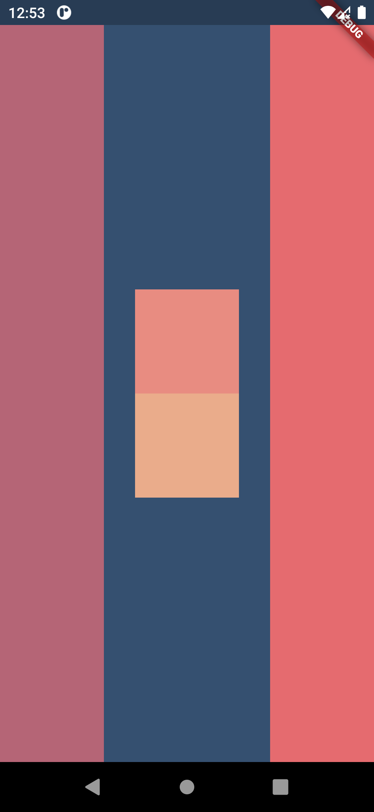

# Flutter-layout

## Table of contents
* [General info](#general-info)
* [Technologies](#technologies)
* [Tools used](#tools-used)
* [Concepts learned](#concepts-learned)
* [Screenshots](#screenshots)

## General info
This project is created to learn the layout management in flutter.

## Technologies
Project is created with:
* Flutter : 2.10.2

## Tools used
Tools used in this project:
* Android Studio

## Concepts learned
Concepts learned through this project:
* [Layout widgets](https://docs.flutter.dev/development/ui/widgets/layout#Multi-child%20layout%20widgets)
* [Single-Child layout widgets](https://docs.flutter.dev/development/ui/widgets/layout#Single-child%20layout%20widgets)
* [Multi-Child layout widgets](https://docs.flutter.dev/development/ui/widgets/layout#Multi-child%20layout%20widgets)

## Screenshots

